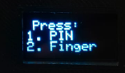
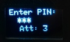
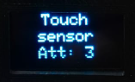
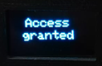
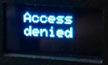
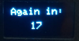

# Funcionamiento del sistema

Cuando el usuario desee ingresar al medio, tendrá dos formas de autenticarse: ingresando un PIN de 6 dígitos o utilizando la huella dactilar. Para elegir entre estas opciones, el usuario verá un menú en la pantalla OLED, en el cual le indica que si oprime el número 1, tendrá la posibilidad de ingresar por medio de PIN; por otra parte, si desea ingresar por reconocimiento de huella, entonces puede ingresar el número 2 en el teclado.

  \
*Menú de elección de autenticación*

## Posibles escenarios al elegir una de estas opciones
### Autenticación mediante PIN
  \
*Indicación para ingresar PIN (tres dígitos ya ingresados)*

- **Usuario desea volver al menú principal:** Si el usuario desea volver al menú principal, puede oprimir la tecla numeral *siempre y cuando se hayan ingresado menos de 6 dígitos*.

- **Usuario desea borrar un dígito:** Si el usuario se da cuenta de que ha ingresado un dígito incorrecto o simplemente desea borrar un dígito para posteriormente volver al menú principal, puede hacerlo presionando el carácter asterisco para eliminar el último dígito ingresado.

- **Usuario desea autenticarse:** Si el usuario ha ingresado los 6 dígitos de la clave y desea verificarlo, simplemente presiona la tecla numeral (#).

### Autenticación mediante reconocimiento de huella
  \
*Indicación para ingresar huella*

- **Lectura correcta:** El lector de huellas dactilares lee con precisión la información biométrica, reconoce al usuario y permite la autenticación exitosa. El color de su anillo se torna verde.

- **Realización de la lectura:** Mientras el lector de huellas realiza el reconocimiento, el anillo del sensor se torna de color amarillo, lo que significa que el usuario debe mantener presionado mientras el sensor esté en ese color.

- **Lectura incorrecta:** El lector de huellas dactilares no pudo leer correctamente la información biométrica del usuario en un intento; o bien, la huella no está registrada en el mismo sensor. En este caso, se ofrecen otros dos intentos.

- **Usuario desea volver al menu principal:** Al igual que el ingreso de PIN, si el usuario desea ingresar volver al menú principal, ya sea para tener la opción de ingresar por huella, puede oprimir la tecla numeral '\#'.

### Escenarios para ambos casos
- **Autenticación correcta:** Se da cuando el usuario ingresa el PIN de 6 dígitos correcto o su huella ha sido exitosamente reconocida.\

- **Autenticación incorrecta:** Se da cuando el usuario ingresa un PIN de 6 dígitos errado o su huella no se encuentra en la base de datos. En este caso, se resta un intento de autenticación (inicialmente cuenta con tres).\

- **Autenticación incorrecta por tercera vez:** Después de tres intentos fallidos de autenticación, el sistema se bloqueará durante 30 segundos y no aceptará ninguna entrada durante ese periodo (en este caso, han transcurrido 13 segundos desde que inició el contador).\

